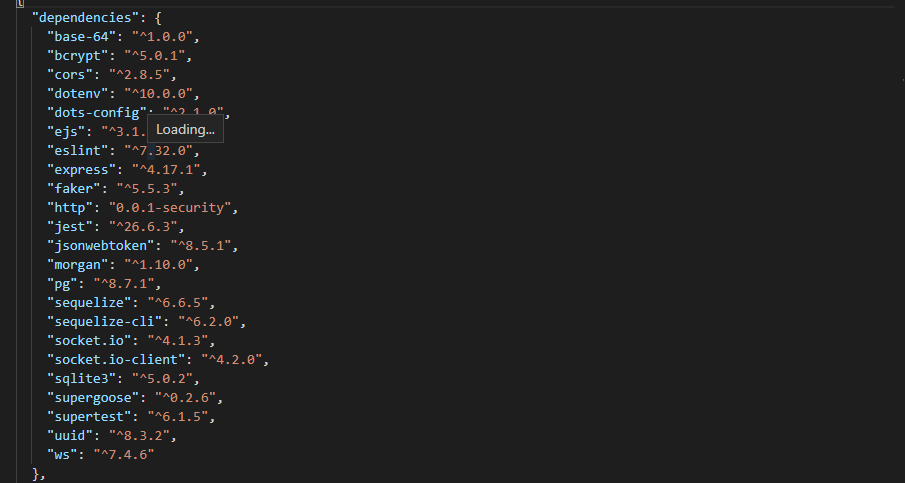
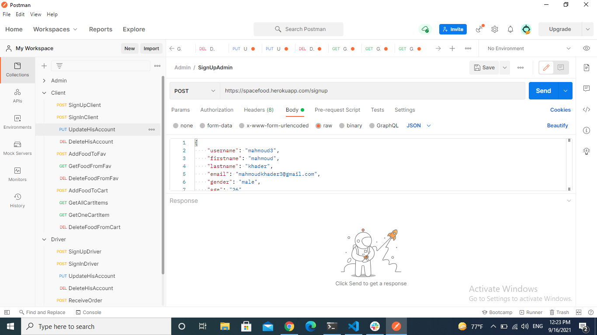
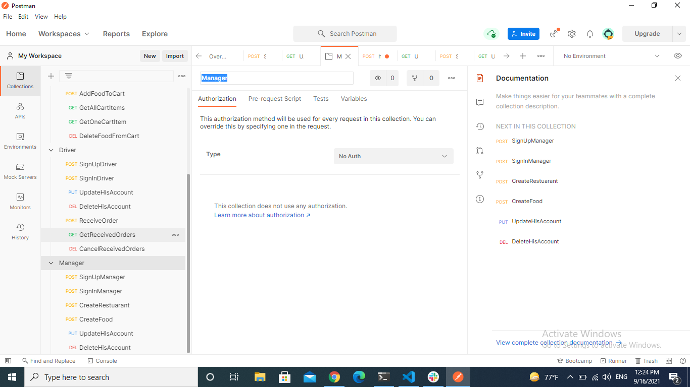
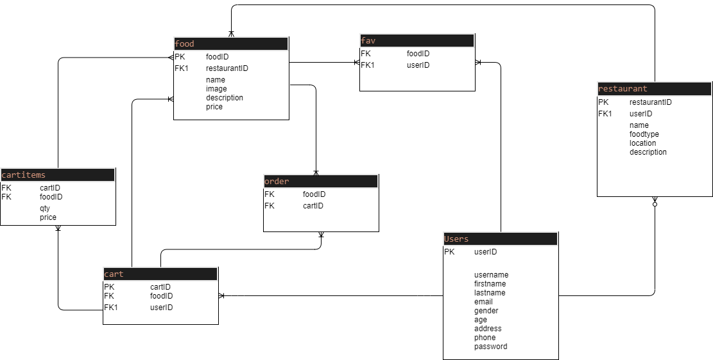
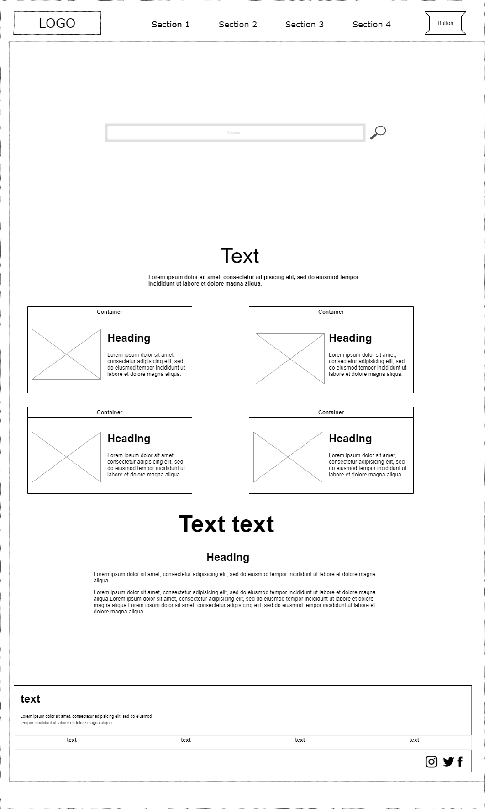
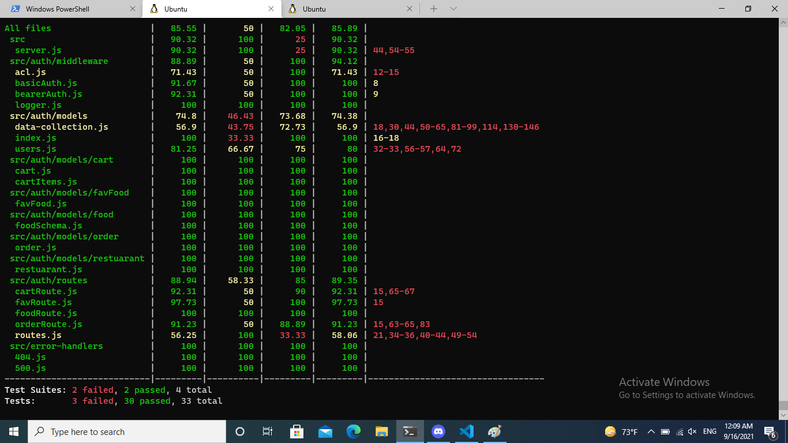

# Food-Jo

---

## Deployment links :

---

[GitHub](https://github.com/resturant-Jo/Food-Space)

[Heroku/client](https://spacefood.herokuapp.com/client)
[Heroku/driver](https://spacefood.herokuapp.com/drever)

## Group Names :

---

- **Team Leader :Mahmoud Khader**
- **Suad Talafha**
- **Saleem Diab**
- **Dena Kofahi**
- **Osama Baker**

## Installation
-------------------
##### Food-Space requires Node.js v14+ to run
`cd Space-Food`
`npm i`
`npm start`

## Configuration

---

Configure the root of your repository with the following files and directories. Thoughfully name and organize any aditional configuration or module files.

- README.md - contains documentation

- .env - contains env variables (should be git ignored)

- .gitignore - contains a .gitignore file

- .eslintrc - contains the course linter configuratoin

- .eslintignore - contains the course linter ignore configuration

- package.json - contains npm package config

* create a `test`script for running tests
* create a `start` script for running your server

- index.js - the entry point for your application
- src/ - contains your core application files and folders

- `__test__/` - contains unit tests

## Authrization
----------------------

- ` user: ['read']`
- `driver: ['read']`
- `manager: ['read', 'create','update']`
- `admin: ['read', 'create', 'update', 'delete'] `

# Dependencies
--------------------

## Auth Routes
-------------------

## ER diagram
-----------------------

## WireFrame
-----------

## Tests
------------

## License

`MIT`
